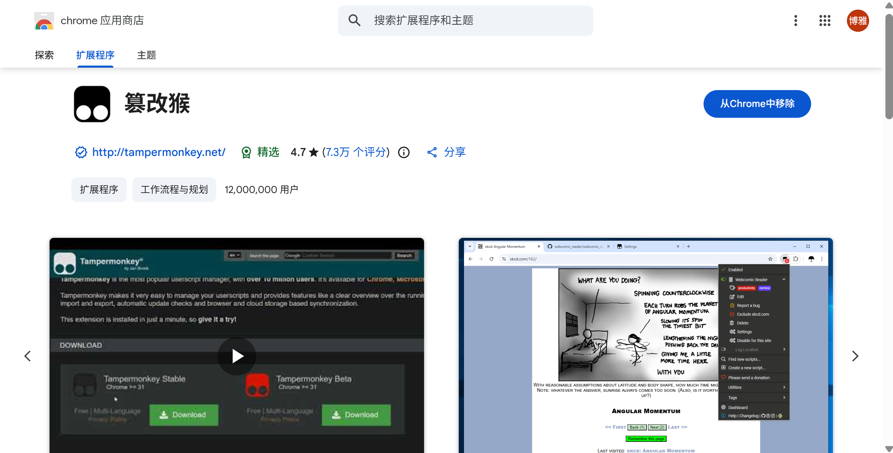
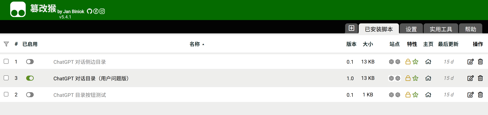
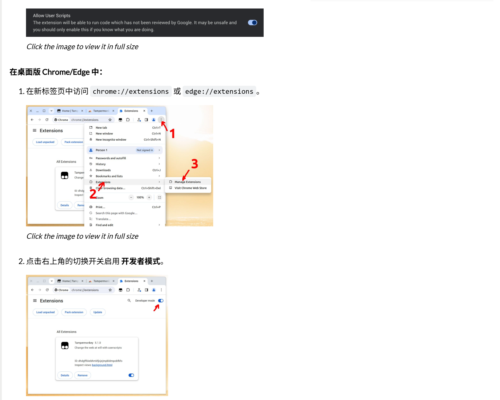

# ChatGPT-toc-sidebar-userscript
A lightweight plugin that automatically generates a navigable table of contents for ChatGPT conversations, making long chats easier to browse and navigate.

## Setup Guide

This tool injects a lightweight sidebar navigation panel into the target webpage using a Tampermonkey userscript.

### 1. Install Tampermonkey

Install the Tampermonkey browser extension for Chrome or Edge.

### 2. Add the userscript

- Open the Tampermonkey dashboard
- Create a new script
- Replace the default template with the JavaScript provided in this repository (see scr/plugin.js)
- Save the script

### 3. Enable userscript permission

Recent Chrome-based browsers may require an additional permission before Tampermonkey can execute userscripts.

- **Chrome/Edge 138+**: enable **Allow User Scripts**
- Otherwise: enable **Developer Mode** on the extensions page

See the Tampermonkey FAQ (Q209) for the official instructions. 

#### Helpful links
- Official Tampermonkey FAQ: https://www.tampermonkey.net/faq.php

### 4. Refresh the page

After saving the script and enabling permission, reload the target webpage. The sidebar navigation should now appear.

---

## Notes

- Users may need to manually enable Tampermonkey’s execution permission the first time.
- If the script does not run, verify that Tampermonkey is enabled and that the browser permission has been granted.
